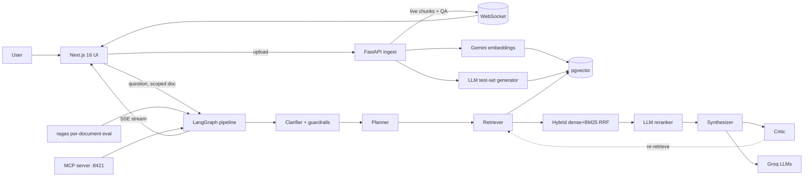

# ReadWork-RAG — Agentic Knowledge Worker

A production-shaped, **zero-API-cost** multi-agent RAG platform. Upload a document, watch
it get chunked, embedded, and turned into its own evaluation test set **live**, then chat
with it through a 5-node LangGraph agent pipeline that plans, retrieves, writes, and
fact-checks its own answers — with citations, a per-document faithfulness score, and a
persistent chat history, all on free-tier infrastructure.

> Built as a placement portfolio project to demonstrate agentic system design, hybrid
> retrieval, evaluation-driven development, and full-stack + DevOps discipline — not a
> tutorial clone.

<!-- 
  SCREENSHOTS — replace with real captures before sharing publicly:
  
  
  
-->

## Overview

Most "RAG demo" projects stop at *upload → embed → answer*. This one treats retrieval
quality as something to be **measured, not assumed**: every document you upload
automatically writes its own golden question set, which then grades the exact agent
pipeline answering it. The result is a system that can report its own faithfulness score
per document, not a single canned number for a marketing screenshot.

## Features

- **Multi-agent LangGraph pipeline** — Clarifier → Planner → Retriever → Synthesizer →
  Critic, with a faithfulness-triggered re-retrieval loop (capped retries) and input
  guardrails (prompt-injection detection, PII redaction).
- **Live agent trace (SSE)** — watch the pipeline execute node-by-node in the browser as
  it streams, instead of staring at a spinner.
- **Hybrid retrieval** — dense (pgvector cosine) + sparse (BM25) fused with Reciprocal
  Rank Fusion, LLM reranking, and parent-child ("small-to-big") chunking.
- **Live chunking visualization** — chunks stream to the UI over WebSocket as they're
  created during ingestion.
- **Self-generating evaluation** — an LLM writes ~5 grounded Q&A pairs per uploaded
  document automatically (streamed live), which become that document's ragas golden set.
  Run evaluation **per document** or across all of them; a CI gate fails the build below a
  faithfulness threshold.
- **Document-scoped chat** — pick a document from a searchable dropdown and every answer
  is retrieved from *only* that document's embeddings; chat history persists per browser
  with a ChatGPT-style sidebar (new chat / switch / delete).
- **Duplicate-safe ingestion** — re-uploading a file with the same name replaces the old
  version and its stale test questions instead of piling up duplicates.
- **Custom MCP server** — 3 tools (`search_documents`, `ask_knowledge_worker`,
  `list_documents`) connectable from Claude Desktop / Cursor, isolated into its own
  dependency environment.
- **Production hardening** — JWT auth, per-route rate limiting, structlog with
  request-scoped trace IDs, token/cost tracking per query, model routing (8B for
  grading/reranking, 70B for synthesis) with automatic rate-limit fallback, CORS
  configured for real deployment topology.
- **Zero paid keys** — Groq free tier + Gemini free embeddings + free-tier Postgres
  (Neon), all with $0.00 marginal cost.

## Architecture



Full diagrams and request lifecycle: [docs/ARCHITECTURE.md](docs/ARCHITECTURE.md).

## Tech stack

| Layer | Choice |
|-------|--------|
| LLM | Groq `llama-3.3-70b-versatile` (synthesis) + `llama-3.1-8b-instant` (grading/routing/QA-gen) |
| Embeddings | Google Gemini `gemini-embedding-001` (3072-dim) |
| Vector DB | PostgreSQL + pgvector (Neon serverless, or self-hosted) |
| Orchestration | LangGraph 0.2 `StateGraph` |
| Backend | FastAPI, async SQLAlchemy 2.0, asyncpg |
| Frontend | Next.js 16 (App Router), TypeScript, Tailwind, shadcn/ui, recharts |
| Realtime | WebSocket (ingestion) + Server-Sent Events (agent trace) |
| Eval | ragas (LLM-as-judge) |
| Auth | JWT (python-jose) + bcrypt |
| Observability | structlog + optional Langfuse |
| MCP | FastMCP (Streamable HTTP), isolated dependency set |
| CI/CD | GitHub Actions (tests + eval gate + frontend lint/build) |
| Deploy | Render (API, Docker) + Vercel (frontend) + Neon (DB) |

## Folder structure

```
├── backend/
│   ├── app/
│   │   ├── agents/          # LangGraph nodes: clarifier, planner, retriever, synthesizer, critic
│   │   ├── api/              # FastAPI routers: query, documents, eval, websocket
│   │   ├── auth/              # JWT auth (register/login, bcrypt)
│   │   ├── database/          # SQLAlchemy models + async connection (Neon-aware)
│   │   ├── evaluation/        # ragas runner, auto QA generator, metrics
│   │   ├── ingestion/          # chunker (parent-child), Gemini embedder, upload router
│   │   ├── mcp_server/          # standalone MCP tools (own venv/deps)
│   │   ├── observability/       # structlog, cost tracking, tracing
│   │   ├── retrieval/            # dense (pgvector), sparse (BM25), hybrid RRF, reranker
│   │   ├── config.py               # pydantic-settings, all env vars
│   │   └── main.py                  # FastAPI app entrypoint
│   ├── tests/                        # pytest suite
│   ├── eval_data/                     # golden QA fallback dataset
│   ├── requirements.txt                # main API deps
│   ├── requirements-mcp.txt             # isolated MCP server deps
│   ├── Dockerfile / Dockerfile.mcp
│   └── ...
├── frontend/
│   ├── src/
│   │   ├── app/                # routes: / (upload), /chat, /documents, /eval, /traces
│   │   ├── components/          # ChatWorkspace, DocumentSelect, LiveAgentTrace, etc.
│   │   └── lib/                  # typed API client, SSE client, localStorage chat store
│   └── Dockerfile
├── docs/                            # architecture, deployment, trade-offs, metrics
├── .github/workflows/ci.yml           # tests + eval gate + frontend build
├── render.yaml                         # Render Blueprint for the backend
└── docker-compose.yml                   # optional local all-in-one stack
```

## Local setup

**Prerequisites:** Python 3.11+, Node 20+, a free [Groq](https://console.groq.com) key, a
free [Google AI Studio](https://aistudio.google.com/app/apikey) key, and a Postgres
database with pgvector — the easiest option is a free [Neon](https://neon.tech) project
(no local Docker needed).

```bash
# 1. Configure
cp .env.example .env
# fill in GROQ_API_KEY, GOOGLE_API_KEY, DATABASE_URL (see Environment Variables below)

# 2. Backend
cd backend
python -m venv venv && source venv/Scripts/activate   # venv/bin/activate on macOS/Linux
pip install -r requirements.txt
uvicorn app.main:app --reload                          # http://localhost:8000/docs

# 3. Frontend (new terminal)
cd frontend
npm install
npm run dev                                             # http://localhost:3000
```

Optional: run the [MCP server](docs/MCP_CLIENT.md) separately (own dependency set — see
why in [docs/TRADE_OFFS.md](docs/TRADE_OFFS.md)):

```bash
cd backend && pip install -r requirements-mcp.txt && python -m app.mcp_server.server
```

Or run the whole stack with `docker compose up --build` if you prefer a local Postgres
container over Neon.

## Deployment

Deployed for $0/month on **Neon (database) + Render (API) + Vercel (frontend)**. Full
step-by-step walkthrough, including exact build/start commands and env var setup:
**[docs/DEPLOYMENT.md](docs/DEPLOYMENT.md)**.

## Environment variables

Names only — see [`.env.example`](.env.example) for the full template with comments.
Never commit real values.

| Variable | Used by | Purpose |
|----------|---------|---------|
| `GROQ_API_KEY` | backend | LLM inference (Groq, free tier) |
| `GOOGLE_API_KEY` | backend | Gemini embeddings (free tier) |
| `DATABASE_URL` | backend | Postgres + pgvector connection string |
| `JWT_SECRET_KEY` | backend | Signs auth tokens |
| `JWT_ALGORITHM`, `JWT_EXPIRY_MINUTES` | backend | Auth token config |
| `CORS_ORIGINS` | backend | Allowed browser origins in production |
| `APP_ENV`, `LOG_LEVEL` | backend | Runtime mode + log verbosity |
| `LANGFUSE_PUBLIC_KEY`, `LANGFUSE_SECRET_KEY`, `LANGFUSE_BASE_URL` | backend | Optional tracing — safe to leave blank |
| `NEXT_PUBLIC_API_URL` | frontend | Backend base URL the browser calls |

## API overview

| Method | Endpoint | Purpose |
|--------|----------|---------|
| POST | `/auth/register`, `/auth/login`, GET `/auth/me` | JWT auth |
| POST | `/ingest/upload?document_id=<uuid>` | Upload → parent-child chunk → embed → auto-generate eval QA (auto-replaces same-name docs) |
| WS | `/ws/ingest/{doc_id}` | Live chunk + QA-generation events |
| POST | `/query` | Single-shot RAG, optional `document_ids` scope |
| POST | `/query/agentic` | Full multi-agent pipeline, optional `document_ids` scope |
| POST | `/query/agentic/stream` | Same pipeline, streamed as Server-Sent Events |
| GET | `/documents`, DELETE `/documents/{id}`, DELETE `/documents` | List / delete one / clear all |
| POST | `/eval/run?document_id=<uuid>` | Run ragas eval — scoped to one document, or all if omitted |
| GET | `/eval/results`, `/eval/questions`, `/eval/cost`, `/eval/status` | Eval results, attached test sets, cost, progress |
| GET | `/health` | Health check |

## Why this project is interesting

- **It's agentic, not a wrapper.** A real LangGraph state machine with a conditional
  self-correction loop — the critic can send the retriever back for another pass.
- **It grades itself.** The evaluation dataset isn't hand-written once and forgotten; it's
  generated fresh from whatever you actually uploaded, so the faithfulness score reflects
  the current corpus, not a canned demo.
- **It survived real infrastructure.** Every integration bug — a pgvector/SQLAlchemy cast
  collision, a serverless-DB connection drop, a Groq `n>1` incompatibility with ragas, a
  CORS misconfiguration masked by curl-only testing — was found by actually running the
  system against live services, then fixed and documented. See
  [docs/TRADE_OFFS.md](docs/TRADE_OFFS.md) for the full list with root causes.
- **It's cost-engineered, not just cost-free.** Model routing (8B vs 70B by task),
  batched/throttled embedding calls, and automatic rate-limit fallback all exist because
  the free tier has real, hard limits — not as decoration.

## Future improvements

- Persist the sparse (BM25) index instead of rebuilding it in memory on every restart.
- Move chat history from `localStorage` to the database so it syncs across devices.
- Add query reformulation to the re-retrieval loop instead of only widening the candidate pool.
- Swap the LLM reranker for a local cross-encoder (e.g. `flashrank`) to cut latency.
- Redis-backed rate limiting for multi-instance deployments.

Full honest trade-offs and limitations: [docs/TRADE_OFFS.md](docs/TRADE_OFFS.md).

## Docs

- [DEPLOYMENT.md](docs/DEPLOYMENT.md) — deploy free on Neon + Render + Vercel
- [ARCHITECTURE.md](docs/ARCHITECTURE.md) — diagrams, request lifecycle, design decisions
- [TRADE_OFFS.md](docs/TRADE_OFFS.md) — real bugs found, root causes, fixes, limitations
- [METRICS.md](docs/METRICS.md) — how to generate and read real eval numbers
- [MCP_CLIENT.md](docs/MCP_CLIENT.md) — wiring the MCP server into Claude Desktop / Cursor

## License

[MIT](LICENSE) © Eeshan Gupta
